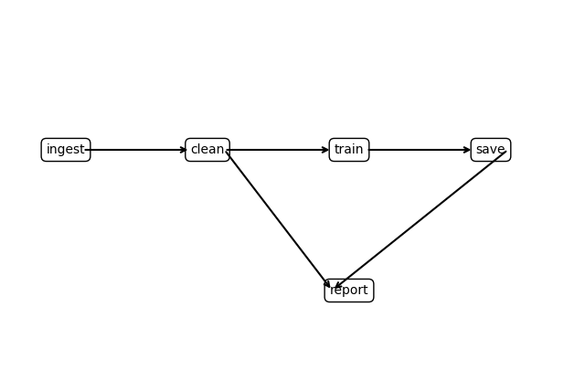

# Stage 15 - Orchestration Plan

## Jobs / Tasks

| Task | Purpose | Idempotent |
|-|-|-|
| `ingest` | Bring source data into the project workspace | True |
| `clean` | Produce a cleaned, analysis-ready dataset | True |
| `train` | Fit model on cleaned data | True |
| `save` | Persist/deploy artifact; write “service up” flag | True |
| `report` | Generate a human-readable summary/report | True |

## Dependencies (DAG)

## Inputs / Outputs

| Task | Inputs | Outputs | Interface |
|-|-|-|-|
| `ingest` | `../data/raw.csv` | `raw.csv` | Python CLI (`argparse`) |
| `clean` | `raw.csv` | `clean.csv` | Python CLI |
| `train` | `clean.csv` | `trained.pkl` | Python CLI |
| `save` | `trained.pkl` | `flask_api_running.txt` | Python CLI |
| `report` | `trained.pkl`, `clean.csv` | `report.md` | Python CLI |

## Logging & Checkpoint Strategy

| Task | Log messages | Checkpoint artifact |
|-|-|-|
| `ingest` | start/end, source URI, row count read | `raw.csv` |
| `clean` | rows in/out, nulls dropped, schema summary | `clean.csv` |
| `train` | hyperparams, seed, metrics (RMSE, MAE) | `trained.pkl` |
| `save` | artifact path, deploy status | `flask_api_running.txt`  |
| `report` | inputs used, sections rendered | `report.md` |

- **Structured logs**: JSONL in `logs/{task}.log` with fields  
  (`run_id`, `ts`, `task`, `level`, `git_sha`, `input_paths`, `output_paths`, `metrics`, `duration_s`, `status`)  

- **Metrics**: Append to `metrics/{task}.csv` for easy charting  

- **Run manifest**: Persist `runs/{run_id}/manifest.json` with input/output hashes for reproducibility  

- **Retries & resilience**: Use `retry(n_tries=3, delay=0.2)` on I/O-heavy steps (`ingest`, `save`, `report`)  

- **Fail-fast rule**: If `ingest` fails, halt downstream tasks; checkpoints ensure safe resumption

## Automation vs. Manual

**Automate**

- `ingest`: deterministic file pull to `raw.csv`  
- `clean`: repeatable transforms (null handling, schema checks)  
- `train`: scripted training with fixed seed & hyperparams  
- `save`: persist model artifact and write deployment marker  
- `report`: templated markdown report generation  

**Manual**

- Data source/schema changes → require human approval  
- Feature list revisions & major hyperparam strategy → analyst review  
- Business sign-off for deployment/rollback → safeguard production risk  
- Narrative polish in reports → human edits for executive audiences  

**Rationale**: Automate deterministic, high-frequency tasks for speed and reproducibility; keep judgment-heavy or risk-bearing tasks manual until processes mature.

## Operational Notes

- **CLI wrappers**: Each task uses argparse-based CLI (`--input`, `--output`) for consistency  
- **Idempotency**: All tasks safe to re-run; outputs depend only on declared inputs  
- **Reproducibility**: Pin random seeds; record environment (`python --version`, `pip freeze`) in `runs/{run_id}/manifest.json`  
- **Checkpoints**: Downstream tasks execute only if upstream checkpoints exist  
- **Failure handling**: If `report` fails, artifacts from `clean` and `train` remain intact and reusable  
- **Execution runner**: A lightweight driver can read the DAG dict and execute tasks topologically with retries
